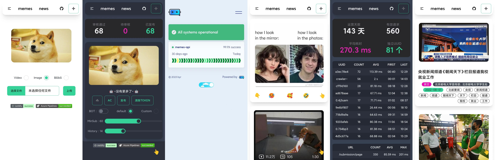
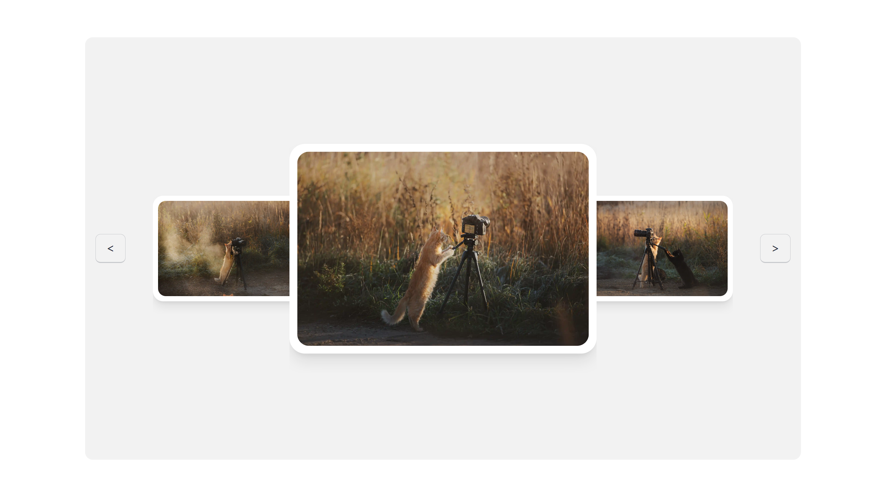

# Memes Frontend

专为北邮人设计的贴图秀投稿系统前端。





## 技术栈

- **框架**: Angular 17
- **样式**: Tailwind CSS + DaisyUI
- **语言**: TypeScript
- **UI组件**: 响应式设计，支持移动端和桌面端
- **功能特性**: 
  - 支持图片/视频上传（拖拽、粘贴、本地选择）
  - 无限滚动浏览
  - 点赞/反馈系统
  - 管理后台
  - 统计数据展示

## 快速开始

### Fork 并部署到 Vercel (详细步骤)

#### 第一步：Fork 项目
1. 点击本项目右上角的 **Fork** 按钮
2. 选择你的 GitHub 账户，Fork 项目到你的仓库

#### 第二步：修改 API 地址
1. 在你 Fork 的项目中，打开 `src/environments/environment.prod.ts` 文件
2. 点击编辑按钮 (铅笔图标)
3. 修改 `host` 字段为你的后端 API 地址：
   ```typescript
   export const environment = {
     production: true,
     host: 'https://your-api-domain.com', // 改成你的后端API地址
   }
   ```
4. 点击 **Commit changes** 提交修改

#### 第三步：部署到 Vercel
1. 访问 [Vercel 官网](https://vercel.com) 并登录（建议用 GitHub 账户登录）
2. 点击 **New Project** 或 **Add New...** → **Project**
3. 在导入页面找到你刚才 Fork 的 `memes-front-master` 项目
4. 点击项目旁边的 **Import** 按钮
5. **配置项目**：
   - **Project Name**: 可以改成 `memes-frontend` 或其他名字
   - **Framework**: Vercel 会自动识别为 **Other**，这没问题
   - **Root Directory**: 保持默认 `./`
   - **Build and Output Settings**: 
     - Vercel 会读取项目根目录的 `vercel.json` 文件自动配置
     - 确认 Build Command 是 `npm --registry https://registry.npmjs.org run build`
     - 确认 Output Directory 是 `dist/memes-fe`
     - 确认 Install Command 是 `npm install --registry https://registry.npmjs.org`
6. 点击 **Deploy** 开始部署

#### 第四步：等待部署完成
1. 部署过程大约需要 2-5 分钟
2. 你会看到构建日志，显示安装依赖和构建过程
3. 部署成功后，Vercel 会给你一个类似 `https://your-project-name.vercel.app` 的网址

#### 第五步：测试部署
1. 访问 Vercel 提供的网址
2. 检查前端是否正常工作
3. 测试是否能正常连接到你的后端 API

#### 注意事项
- **重要**: 确保你的后端 API 已经部署并正常运行
- 确保后端 API 支持 CORS 跨域请求，允许来自 Vercel 域名的请求
- 如果部署失败，检查构建日志中的错误信息
- 每次修改代码并推送到 GitHub，Vercel 会自动重新部署

#### 自定义域名（可选）
1. 在 Vercel 项目页面，点击 **Settings** → **Domains**
2. 添加你的自定义域名
3. 按照提示配置 DNS 记录

### 本地开发

```bash
# 安装依赖
npm install

# 启动开发服务器
npm start

# 构建生产版本
npm run build
```

## 配置说明

### 环境配置

- `src/environments/environment.ts` - 开发环境配置
- `src/environments/environment.prod.ts` - 生产环境配置

### 主要配置项

- `host`: 后端API地址，需要根据你的后端部署情况进行修改

## 功能特性

### 图片/视频上传
- 支持直接粘贴剪贴板内容 (Ctrl+V)
- 支持拖拽文件上传
- 支持本地文件选择
- 自动图片压缩优化

### 浏览体验
- 无限滚动加载
- 瀑布流布局
- 响应式设计
- 懒加载优化

### 交互功能
- 点赞/反馈系统
- 内容举报
- 管理员审核
- 统计数据查看

## 演示地址

🎉 **欢迎访问演示站点**: https://meme.smone.us

欢迎大家来投稿分享有趣的贴图和视频！

## 部署注意事项

1. 确保后端API支持CORS跨域请求
2. 修改环境配置中的API地址为你的实际后端地址
3. 如果使用CDN，注意静态资源的缓存策略

## 开发指南

### 项目结构
```
src/
├── app/
│   ├── submission/        # 投稿相关组件
│   ├── review/           # 审核管理
│   ├── statistic/        # 统计页面
│   ├── service/          # API服务
│   └── model/            # 数据模型
├── assets/               # 静态资源
└── environments/         # 环境配置
```

### 主要服务
- `SubmissionService` - 投稿内容管理
- `AdminService` - 管理员功能
- `ReviewService` - 内容审核

## FAQ

> 为什么我的客户端看不到图片？

可以考虑更新 app 的版本：https://github.com/BYR-App-Dev/BYR_App_Android_Release

> 为什么上传的图片看起来有点糊？

前端对要上传的图片进行了压缩，因此分辨率会降低。你可以在代码中调整压缩参数。

> 如何修改API地址？

编辑 `src/environments/environment.prod.ts` 文件中的 `host` 字段。

## 贡献

欢迎提交 Issue 和 Pull Request 来改进项目！

## 许可证

本项目仅供学习交流使用。